<!-- ═══════════════════════════════════════════════════════════
     ⚙️ PROFILE OS · everything below self-updates via Actions
════════════════════════════════════════════════════════════ -->

<div align="center">




</div>

## <code>~/about</code>

```ts
const dev = {
  name:      "vyankatesh",
  role:      "self learning Engineer",
  stack:     ["TypeScript", "Go", "Rust", "React", "Kubernetes"],
  currently: "building AI-native dev tools",
  funFact:   "I debug with console.log and pride",
  motto:     "ship it, then make it faster ⚡",
};
```

## <code>~/stack</code>

<div align="center">


</div>

## <code>~/stats</code>

<div align="center">

<picture>
  <source media="(prefers-color-scheme: dark)"
    srcset="https://github-readme-stats.vercel.app/api?username=YOUR_USERNAME&show_icons=true&theme=transparent&hide_border=true&include_all_commits=true&count_private=true&rank_icon=percentile&icon_color=34d399&title_color=38bdf8&text_color=e2e8f0"/>
  
</picture>
<picture>
  <source media="(prefers-color-scheme: dark)"
    srcset="https://github-readme-stats.vercel.app/api/top-langs/?username=YOUR_USERNAME&layout=compact&theme=transparent&hide_border=true&langs_count=8&title_color=38bdf8&text_color=e2e8f0"/>
  
</picture>


</div>

## <code>~/analytics</code> · generated nightly by CI

<div align="center">


<details>
<summary><b>📈 more graphs</b></summary>


</details>

</div>

## <code>~/connect</code>

<div align="center">

[](mailto:you@example.com)
[](https://x.com/you)
[](https://linkedin.com/in/you)
[](https://dev.to/you)

</div>

## <code>~/snake</code>

<div align="center">

<picture>
  <source media="(prefers-color-scheme: dark)"
    srcset="https://raw.githubusercontent.com/YOUR_USERNAME/YOUR_USERNAME/snake/github-snake-dark.svg"/>
  <source media="(prefers-color-scheme: light)"
    srcset="https://raw.githubusercontent.com/YOUR_USERNAME/YOUR_USERNAME/snake/github-snake.svg"/>
  
</picture>

<sub>the snake eats my contributions · regenerated every 12h by CI 🐍</sub>

**⚡ powered by raw SVG + GitHub Actions — no servers, no JS**

</div>
